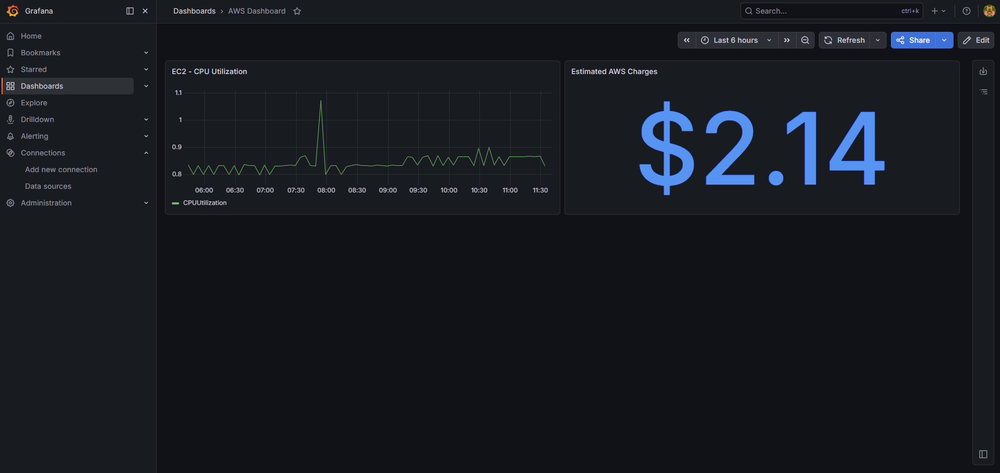
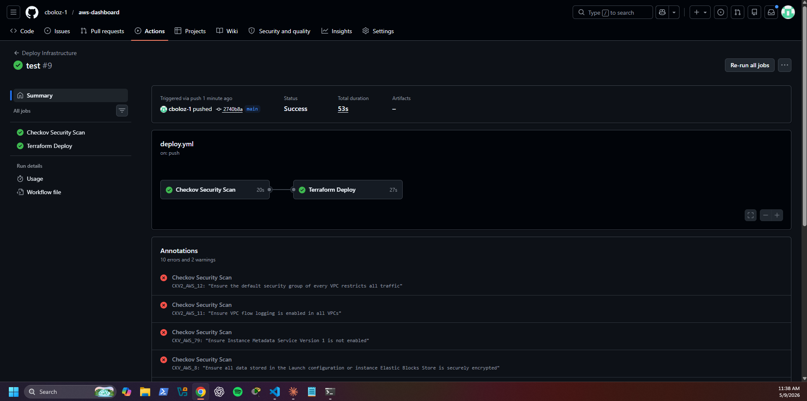
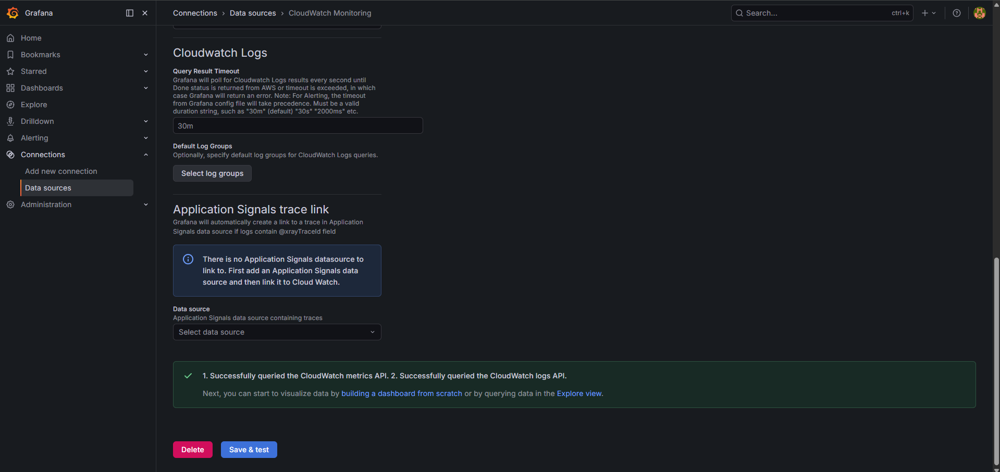

# AWS Infrastructure Dashboard

A CI/CD pipeline and live infrastructure monitoring dashboard built on AWS. Every push to main triggers an automated pipeline that scans Terraform for security misconfigurations, deploys infrastructure changes, and sends an email notification on success or failure. Infrastructure metrics are visualized in a self-hosted Grafana dashboard connected to CloudWatch.

## Dashboard



## Pipeline



## CloudWatch Integration



## Stack

| Tool | Purpose |
|------|---------|
| Terraform | Provisions VPC, EC2, IAM roles, security groups |
| GitHub Actions | CI/CD pipeline — runs on every push to main |
| Checkov | Scans Terraform for security misconfigurations |
| Docker | Runs Grafana in a container on EC2 |
| Grafana | Live dashboard connected to CloudWatch |
| AWS CloudWatch | Metrics source — EC2 CPU, billing data |
| AWS SNS | Email notifications on pipeline success or failure |
| S3 | Remote Terraform state backend |

## Architecture

```
GitHub push
    ↓
GitHub Actions pipeline
    ├── Checkov security scan (soft fail)
    └── Terraform apply
            ↓
        EC2 instance (Ubuntu 22.04)
            └── Docker
                    └── Grafana → CloudWatch
    ↓
SNS email notification (success or failure)
```

## Pipeline Details

The GitHub Actions pipeline runs automatically on every push to main:

1. **Checkov Security Scan** — scans all Terraform files for security misconfigurations against AWS best practices
2. **Terraform Deploy** — initializes backend, runs plan, applies changes
3. **SNS Notification** — sends email with success or failure status, branch, and commit SHA

## Dashboard Panels

- **EC2 CPU Utilization** — live time series graph pulled from CloudWatch
- **Estimated AWS Charges** — current month spend displayed as a stat panel

## Infrastructure

- Custom VPC with public subnet, internet gateway, and route table
- EC2 t2.micro running Ubuntu 22.04 LTS
- IAM role attached to EC2 with CloudWatch read access — no credentials needed in Grafana
- Security group allowing ports 22 (SSH) and 3000 (Grafana)
- EC2 instance metadata hop limit set to 2 for Docker compatibility
- Terraform state stored remotely in S3 with versioning enabled

## Project Structure

```
aws-dashboard/
├── .github/
│   └── workflows/
│       └── deploy.yml       # GitHub Actions pipeline
├── terraform/
│   ├── main.tf              # VPC, EC2, IAM, security groups
│   ├── providers.tf         # AWS provider + S3 backend
│   └── variables.tf         # Input variables
├── grafana/
│   └── docker-compose.yml   # Grafana container config
└── screenshots/             # Project screenshots
```

## Notes

- Built and tested from WSL on Windows
- Grafana runs in Docker on EC2, connected to CloudWatch via EC2 IAM role
- Pipeline uses GitHub Secrets for AWS credentials — no credentials stored in code
- Checkov findings are informational — soft fail keeps the pipeline running while surfacing security improvements